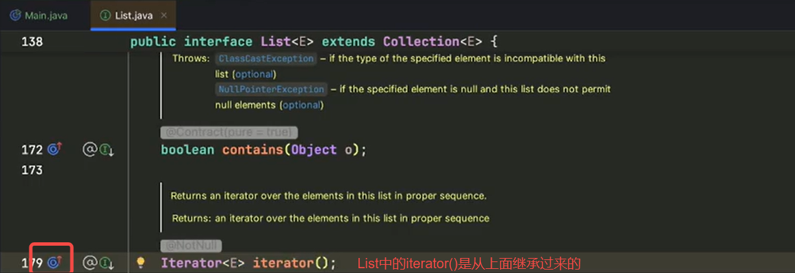
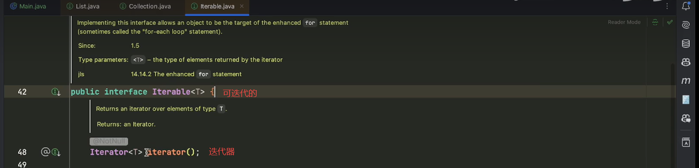
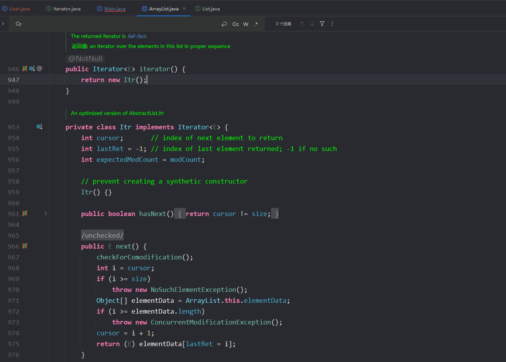

# 迭代器模式

现在有这么一个 `User` 类，和一个 `Main`：

```java
public class User {
    private String name;
    private int age;

    public User(String name, int age) {
        this.name = name;
        this.age = age;
    }

    @Override
    public String toString() {
        return "User{" +
                "name='" + name + '\'' +
                ", age=" + age +
                '}';
    }
}

public class Main {
    public static void main(String[] args) {
        List<User> userList = new ArrayList<>();
        User tom = new User("tom", 11);
        User jerry = new User("jerry", 11);
        userList.add(tom);
        userList.add(jerry);
        for (User user : userList) {
            System.out.println(user);
        }
    }
}
```

现在有一个问题，我们的增强 `for` 循环里面，为什么可以把 `list` 放到增强 `for` 循环的被循环的位置。能否把 `user` 放进去。

我们知道我们的 `for` 循环，最终其实是调用的 `userList` 的 `iterator` 函数。实际代码如下：

```java
Iterator<User> iterator = userList.iterator();
while (iterator.hasNext()) {
    User user = iterator.next();
    System.out.println(user);
}
```

增强 `for` 循环的本质是我们拿到了这个类的迭代器，调用了这个迭代器的 `hasNext()` 函数和 `next()` 函数，最终来执行我们的逻辑。







如果我们有一个对象实现了这个接口 `Iterable`，我们就可以把它放到增强 `for` 循环里。

```java
public class User implements Iterable<String> {
    private String name;
    private int age;

    public User(String name, int age) {
        this.name = name;
        this.age = age;
    }

    @Override
    public String toString() {
        return "User{" +
                "name='" + name + '\'' +
                ", age=" + age +
                '}';
    }

    @Override
    public Iterator<String> iterator() {
        return null;
    }
}
```

这样之后，我们就可以把 `tom` 放在增强 `for` 循环中了。

我们要分清一个是 `Iterable`，表示**可迭代的**；一个是 `Iterator`，表示**迭代器**。`Iterator` 有 2 个核心函数，我们在 `User` 中创建一个内部类，去实现这个 `Iterator`。此时的代码如下：

```java
public class User implements Iterable<String> {
    private String name;
    private int age;

    public User(String name, int age) {
        this.name = name;
        this.age = age;
    }

    @Override
    public String toString() {
        return "User{" +
                "name='" + name + '\'' +
                ", age=" + age +
                '}';
    }

    @Override
    public Iterator<String> iterator() {
        return new UserIter();
    }

    class UserIter implements Iterator<String> {
        int count = 2;

        @Override
        public boolean hasNext() {
            return count > 0;
        }

        @Override
        public String next() {
            count--;
            if (count == 1) {
                return User.this.name;
            }
            if (count == 0) {
                return User.this.age + "";
            }
            throw new NoSuchElementException();
        }
    }
}
```

测试代码如下：

```java
public class Main {
    public static void main(String[] args) {
        User tom = new User("tom", 11);
        for (String s : tom) {
            System.out.println(s);
        }
    }
}
```

返回示例如下：

```text
tom
11
```

接下来我们来看一下 JDK 中的 `List` 是如何实现的。





其中 `checkForComodification` 中有一个计数统计，每次 `add` 都会修改我们的计数。所以在迭代器中不能修改元素。这个是在 `next` 函数中调用的，所以调用一次完直接退出不会抛出异常。

需求：将 `demo.user` 文件中的内容转为 `User` 对象

文件内容如下：

```text
[张三,11]
[李四,12]
[王五,13]
[tom,1]
[jerry,2]
[gkj,3]
```

我们的代码如下：

```java
public class Main {
    public static void main(String[] args) throws IOException {
        List<User> userList = new ArrayList<>();

        readUsers((user) -> {
            System.out.println(user);
            userList.add(user);
        });
    }

    private static void readUsers(Consumer<User> userConsumer) throws IOException {
        List<String> lines = Files.readAllLines(new File("demo.user").toPath());
        for (String line : lines) {
            String midString = line.substring(1, line.length() - 1);
            String[] split = midString.split(",");
            String name = split[0];
            int age = Integer.parseInt(split[1]);
            User user = new User(name, age);
            userConsumer.accept(user);
        }
    }
}
```

这里有两个问题：

1. 每一次进行操作时都要进行 `readUsers`
2. 一次性读取所有文件可能发生 OOM

我们可以使用迭代器模式重构一下这部分的功能。

```java
public class UserFile implements Iterable<User> {

    private final File file;

    public UserFile(File file) {
        this.file = file;
    }

    @Override
    public Iterator<User> iterator() {
        return new UserFileIterator();
    }

    class UserFileIterator implements Iterator<User> {
        List<User> userList = loadUserFromFile();
        int cursor = 0;

        private List<User> loadUserFromFile() {
            try {
                return Files.readAllLines(file.toPath()).stream()
                        .map((line) -> {
                            String midString = line.substring(1, line.length() - 1);
                            String[] split = midString.split(",");
                            return new User(split[0], Integer.parseInt(split[1]));
                        }).collect(Collectors.toList());

            } catch (IOException e) {
                e.printStackTrace();
                return null;
            }
        }

        @Override
        public boolean hasNext() {
            return cursor != userList.size();
        }

        @Override
        public User next() {
            if (cursor >= userList.size()) {
                throw new NoSuchElementException();
            }
            int currentIndex = cursor;
            cursor++;
            return userList.get(currentIndex);
        }
    }
}
```

在 `Main` 中，我们的代码如下：

```java
public class Main {
    public static void main(String[] args) throws IOException {
        File file = new File("demo.user");

        UserFile users = new UserFile(file);
        for (User user : users) {
            System.out.println(user);
        }
    }
}
```

返回示例如下：

```text
User{name='张三', age=11}
User{name='李四', age=12}
User{name='王五', age=13}
User{name='tom', age=1}
User{name='jerry', age=2}
User{name='gkj', age=3}
```
